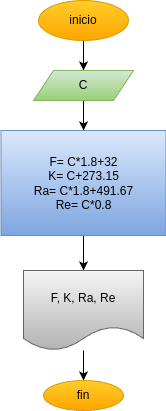

# convertir-C-a-F-K-Ra-y-Re
Programa en Python para convertir grados centigrados a grados fahrenheit, kelvin, Rankine y Réaumur

## Análisis

### Variables de entrada
- C: Grados centígrados

### Procesamiento
F: Grados Fahrenheit
K: Grados Kelvin
Ra: Grados Rankine
Re: Grados Réaumur

- F= C * 1.8 + 32
- K= C + 273.15
- Ra= C * 1.8 + 491.67
- Re= C * 0.8

## Diseño

## Construcción

- código implementado en el archivo convertir_°C_a_°F_°K_°Ra_°Re.py